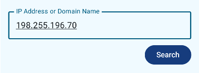

# "IP Geolocation" App

**Author:** Michael Stringham

**Purpose:** Hilton Android Code Challenge

> This code challenge is based on the IP geolocation provided by https://ip-api.com/docs/api:json


# Code Challenge Steps

## STEP 1:

> Create a relational database schema where you can store the results from the API call

For this first step, I have chosen to define the database schema for [this API](https://ip-api.com/) using DBML ([Database Markup Language](https://dbml.dbdiagram.io/home)), which can be used to output schemas for various databases including SQLite and MySQL. This initial schema starts as:

```
Table geolocation {
  id integer [ pk, unique, increment, note: 'Unique identifier' ]
  query varchar [unique, note: 'IP Address entered via UI']
  status query_status
  country varchar
  countryCode varchar
  region varchar
  regionName varchar
  city varchar
  zip varchar
  lat decimal(3,4)
  lon decimal(4,4)
  timezone varchar
  isp varchar
  org varchar
  as varchar
}

Enum query_status {
  success
  fail
}

```

**Note:** The table is named "geolocation" (and not "ipgeolocation") since the query can represent an empty string, an IP address, *or* a domain name.


## STEP 2:

> Implement the database schema from the first step using a database of your choice (using Room is highly recommended)

Using Room (an abstract layer over SQLite), the database schema becomes:

```
@Entity(
    tableName = "geolocation",
    indices = [Index(value = ["query"], unique = true)]
)
data class Geolocation(
    @PrimaryKey(autoGenerate = true)
    val id: Int = 0,

    val query: String,
    val status: String,
    val country: String = "",
    val countryCode: String = "",
    val region: String = "",
    val regionName: String = "",
    val city: String = "",
    val zip: String = "",
    val latitude: Double = 0.0,
    val longitude: Double = 0.0,
    val timezone: String = "",

    @ColumnInfo(name = "isp")
    val internetServiceProvider: String = "",

    @ColumnInfo(name = "org")
    val organization: String = "",

    @ColumnInfo(name = "as")
    val autonomousSystem: String = ""
)
```

The last 3 fields shown here (such as "internetServiceProvider") could have been named as-is, but I showcase the ColumnInfo annotation to match the name of the field as defiend in the ip-api response json.


## STEP 3:

> Create a simple Activity with a text input (to insert an IP address) and a button (to perform the search)

I created an Activity which contains an input field and search button. It is the "Home Screen."




## STEP 4:

> When clicking on the search button retrieve the geolocation data from the database, if it does not exist retrieve it from the API and store it to the database before rendering it in the UI

When clicking on the Home Screen's Search button:

- It checks the Room database for a query match
- If found, the Geolocation results are displayed on the Home Screen
- If not found in the database ("lcoal cache"), then the network API is called for the given query. Upon return of the API call, its results get persisted to the Room database, then shown on the Home Screen (UI).

The Home Screen also has a History button, which navigates to a History Screen  (a flat list of items from the database).

This image shows 4 screenshots: 3 of the Home Screen, and 1 of the History Screen.


Future enhancements to the Home Screen results could have inclued a mapping solution, such as MapBox or Google Maps. Also, if results were paginated, I could have used the RemoteMediator API to load netowrk data into a local cache (Room) as well as pagination.


## STEP 5.

> Think about a way to automatically test this application so that you end up with reliable and reproducible results

There are 2 main tetsing efforts added to this app: `androidtest` and `test`.

The `androidTest` package includes testing efforts that rely on the Android framework, namely Room Database testing and Network API calls (via Retrofit).

- the Room Database tests use an in-memory database to test insertions, deletions, and updates
- the network API tests the network repository, which in turn calls the Retrofit API call function. Automatic JSON serialization is making use of GSON (via GsonConverterFactory), but other converters could be used, such as: jackson, moshi, protobuf, etc.

The `test` package includes Unit Tests that don't rely on the Android framework. They currfently include testing the Validation class responsible for determining whether the "text input" (on the Home Screen) has valid query data.

- According to the [API docs](https://ip-api.com/docs/api:json), a valid query can be:
	- Empty string (uses the current IP address)
	- IP Address (I chose to handle IPv4 for simplicity)
	- Domain Name
- The unit tests for the Validation class handle all 3 query types

Note: My Unit Tests helped me to uncover a small, subtle flaw: The function `isBlank()` needed to be `isEmpty()` in `Validation.isQueryValid()`. This was fixed during testing!


In terms of **automatically** testing this code, there are a few options that could be added to an Android project:

1. A **CI/CD** (continuous integration and continuous delivery/deployment) process could be used to trigger automatic builds whenever a team member commits code to a code repository (such as GutHub, Bitbucket, etc.). In addition to producing a release build, the CI/CD process can also trigger tests - therefore the system will automatically test the code each time a commit is processedd.
2. Another approach would be to add a **Git Hook** to run tests upon each `git push` from the client. For example, a file named "pre-push" can be created in the folder `your_repo/.git/hooks`, and make it executable (via command `chmod +x pre-push`), and configure it to run gradle tasks such as `./gradlew clean test` or `./gradle check`. This approach would require each team member to configure git hooks on their own development machine.

These techniques can help provide reliable results in the application by catching issues as soon as they are pushed to a shared repository. Also, by having these tests run each and every time, over and over again, it helps to ensure reproducible results.


# Optional Steps


## STEP 6.

> Extend your database schema adding a new column with the insertion timestamp

I added the new timestamp column to the Room Database, and defined it as:

`var timestamp: Long = System.currentTimeMillis()`

So, the final version of the Room Database table ("Geolocation" entity) is:

```
@Entity(
    tableName = "geolocation",
    indices = [Index(value = ["query"], unique = true)]
)
data class Geolocation(
    @PrimaryKey(autoGenerate = true)
    val id: Int = 0,

    val query: String,
    val status: String,
    val country: String = "",
    val countryCode: String = "",
    val region: String = "",
    val regionName: String = "",
    val city: String = "",
    val zip: String = "",
    val latitude: Double = 0.0,
    val longitude: Double = 0.0,
    val timezone: String = "",

    @ColumnInfo(name = "isp")
    val internetServiceProvider: String = "",

    @ColumnInfo(name = "org")
    val organization: String = "",

    @ColumnInfo(name = "as")
    val autonomousSystem: String = "",

    var timestamp: Long = System.currentTimeMillis()
) {
    fun isSuccess() = status == QueryStatus.success.name

    fun formatTimestamp(): String {
        return DateFormat.format("yyyy-MM-dd HH:mm:ss", timestamp).toString()
    }
}
```

If the timestamp field in this RoomDB was added to this codebase at a later time (such as a release or two later), I could have used Room's Migrations feature (via `.addMigrations()`). Instead, I have opted for the simpler `.fallbackToDestructiveMigration()` method of recreating the database upon any schema changes.

It includes 2 helper functions.

- The `isSuccess` is a utility function to determine whether a recent API call was successful, by checking the `status` field for "success"
- The `formatTimestamp` utility function is used to convert a timestamp from milliseconds to a human-readable String


## STEP 7.

> Modify the fourth point to refresh the geolocation data if the timestamp is older than 5 minutes

I modified the Home Screen's ViewModel to include this new business requirement. Instead of simply returning a database entry when the query matches, I now introduce a 5-minute check to see if the database results are "stale". If the database entry is older than 5 minutes, then I fetch new, fresh results from the network API, and updated the database entry accordingly.

```
if (dbResult.timestamp < System.currentTimeMillis() - STALE_MILLIS) {
    callApiWithQuery()
    HomeState.Network // Update state: network call is running
} else {
    HomeState.Result(currentResult = dbResult, source = QuerySource.LOCAL)
}

. . .

companion object {
    private const val STALE_MILLIS = 5 * 60 * 1_000L // 5 minutes
}
```


## STEP 8.

> Take error handling and logging in consideration and think about ways of validating the input data

#### Error Handling

This Android app uses concepts from **MVVM** and **Clean Architecture** and **Dependecy Injection** (via "Hilt", to help build apps at scale), with error handling included. For example, the Domain Layer (Use Cases) uses try/catch blocks to surround calls to the database or network. If an error occurs, they are wrapped in a `Resource` object, and passed back to the ViewModel and View for handling. Successful database and network calls are also wrapped in a `Resource` object, together with the appropriate data from the call. These try/catch blocks are also operating within the context of a Coroutine so as not to block the responsiveness of the UI.

The UI will display errors if there is a Network Timeout, or if the Query is invalid, or if there are Database issues. This provides a responsive app that handles back-end errors gracefully.


#### Logging

Logging is important for several reasons:

- It can help identify issues in the code before and during the launch of the app in produciton

- It can help developers understand the flow of logic while debugging the app - especially for those who are new to the codebase

- Logs can be sent to a remote debugging service so that issues can be diagnosed outside of the local debugging environment (in produciton, etc.)

- Logs can also help with tracking the usage of various items in the app as well as providing performance insights

- Logs can also be a form of documenting the code, if used appropriately

I chose to add the **Timber** logging library to the app. I have included Error logs in the Use Cases of the domain model (domain package) so that any failures are logged using the Error level.

It is also important to prevent **PII** ("Personal Identifiable Information") from appearing in log statements. This ensures that sensitive information (whether from the developers, the company, or the end-user) is not exposed.

I included a few other debug-level logs elsewhere in the app, to show the **flow** of activity such as when the Database is called ("Fetch from DB") or data from the network is fetched ("Fetch from API").

Another logging feature that was added was the use of a **Logging Interceptor** (`HttpLoggingInterceptor()`) in the Hilt Module. It provides details of API calls and places them in the log history. An example:

```
--> GET http://ip-api.com/json/198.255.196.70
--> END GET
<-- 200 OK http://ip-api.com/json/198.255.196.70 (251ms)
...
Content-Type: application/json; charset=utf-8
Content-Length: 311
...
{"status":"success","country":"United States","countryCode":"US","region":"NY","regionName":"New York","city":"Hilton","zip":"14468","lat":43.2912,"lon":-77.7894,"timezone":"America/New_York","isp":"Charter Communications Inc","org":"Spectrum","as":"AS11351 Charter Communications Inc","query":"198.255.196.70"}
<-- END HTTP (311-byte body)
```


## Final comment

Thank you for allowing me to showcase a few Android fetures and techniques by creating this app!